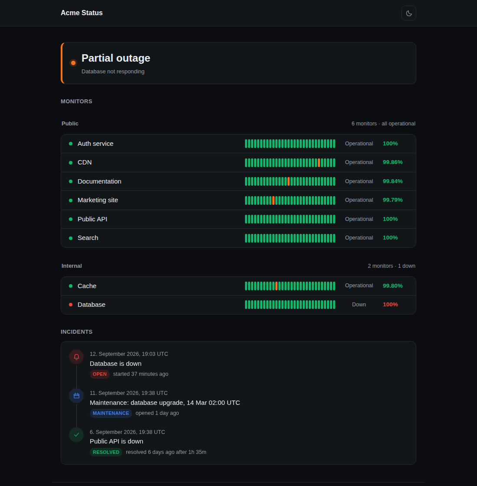

# Status page

Uptime monitoring inspired by [Upptime](https://github.com/upptime/upptime) that runs entirely on GitHub: checks run as a scheduled
Action, history is committed to this repository, outages open and close GitHub
issues, and the status page is published with GitHub Pages.



## Setup

1. Fork or copy this repository.
2. **Settings → Pages → Source**: select *GitHub Actions*.
3. **Settings → Actions → General → Workflow permissions**: select *Read and
   write permissions*.
4. Add one repository variable per monitor under **Settings → Secrets and
   variables → Actions → Variables** (see below), or a secret in the same place
   for a monitor whose URL should stay private.
5. Run the **Uptime** workflow once from the Actions tab.

## Custom domain

Point DNS at GitHub, then set the domain under **Settings → Pages → Custom
domain** and enable *Enforce HTTPS* once the certificate is issued.

```
# subdomain
status  CNAME  <user>.github.io.

# apex domain
@  A     185.199.108.153, 185.199.109.153, 185.199.110.153, 185.199.111.153
@  AAAA  2606:50c0:8000::153, 2606:50c0:8001::153, 2606:50c0:8002::153, 2606:50c0:8003::153
```

Because Pages is published from a workflow rather than a branch, no `CNAME`
file is needed: the domain is stored in the repository's Pages configuration,
and an existing `CNAME` file is ignored. Deployments cannot drop it.

Verify the domain under account or organization **Settings → Pages** to keep
someone else from claiming it if this repository is renamed or deleted. If DNS
is proxied through Cloudflare, keep the record DNS-only until GitHub has issued
the certificate.

## Site variables

| Variable | Default | Description |
| --- | --- | --- |
| `SITE_TITLE` | `Status` | Page and browser title |
| `SITE_DESCRIPTION` | none | Line under the status banner |
| `SITE_LINK` | none | Link in the footer |
| `SITE_LOGO` | none | Logo URL shown next to the title |
| `SITE_THEME` | `auto` | `auto`, `light` or `dark` |
| `SITE_LANG` | `en` | Language of the page, its issues and its notifications: `en` or `de`, see [Languages](#languages) |
| `INCIDENT_THRESHOLD` | `2` | Consecutive failed checks before an issue is opened |
| `INCIDENT_LABELS` | `status,incident` | Labels applied to incident issues. `maintenance` is reserved and ignored here |
| `MONITORS_HEADING` | `Affected monitors` | The maintenance form's monitors field label, which is how affected monitors are found |

## Monitors

Every monitor is a repository variable named `MONITOR_<NAME>`. The name after
the prefix becomes the slug and the default display name. The value is either a
plain URL or a JSON object.

```
MONITOR_WEBSITE   https://example.com
MONITOR_API       {"name":"Public API","url":"https://api.example.com/health","keyword":"ok","group":"Core"}
MONITOR_SMTP      {"name":"Mail","url":"tcp://mail.example.com:25","keyword":"220"}
MONITOR_GATEWAY   {"name":"Gateway","url":"ping://gw.example.com"}
MONITOR_OFFICE    {"name":"Office WiFi","url":"dummy://up"}
```

An `http` or `https` URL is requested over HTTP. A `tcp://host:port` URL is
checked by opening a connection: the monitor is up when the handshake
completes, and the measured time is the handshake itself. With `keyword` set,
the check also waits for the first chunk the server sends and matches it
against that string, which covers banner protocols such as SMTP, SSH or IMAP.
`method`, `headers`, `body`, `expectedStatus` and `followRedirects` do not
apply to a TCP monitor, and its address is not offered as a link — set `link`
if the monitor should point somewhere a browser can follow.

A `ping://host` URL sends one ICMP echo through the system `ping` binary and
measures the round trip. It needs `ping` on the runner, ignores `keyword`
along with the HTTP options, and is also not offered as a link.

A `dummy://` URL is not checked at all and is always reported up, for a
service whose state is followed somewhere else, or to hold a place on the page.
Everything else about the monitor works as usual, but nothing is measured, so
it has no response times.

**ICMP does not work on GitHub-hosted runners.** They are Azure virtual
machines, and Azure blocks ICMP, so a ping monitor reports `socket: Operation
not permitted` or `no reply` no matter how healthy the host is. Use ping only
with a self-hosted runner; on hosted runners check a port with `tcp://`
instead. To see where you stand, add `MONITOR_PINGTEST` as `ping://1.1.1.1`,
run the Uptime workflow once and read the "Run checks" step: `up` means ICMP
works for you, anything else means it does not.

| Key | Default | Description |
| --- | --- | --- |
| `url` | required | `https://…` to request, `tcp://host:port` to connect to, `ping://host` to ping, or `dummy://` for a monitor that is always up |
| `name` | derived from the variable name | Display name |
| `method` | `GET` | HTTP method |
| `headers` | `{}` | Request headers |
| `body` | none | Request body |
| `expectedStatus` | `2xx` | Status code, `2xx` style pattern, `200-299` range, or an array of those |
| `keyword` | none | Response body, or the first chunk of a TCP banner, must contain this string |
| `timeout` | `10000` | Milliseconds before the request is aborted |
| `retries` | `1` | Extra attempts before a check counts as failed |
| `degradedMs` | `0` | Responses slower than this are reported as degraded (`0` disables) |
| `followRedirects` | `true` | Follow 3xx responses |
| `group` | none | Groups monitors under a heading |
| `description` | none | Shown in the monitor's details |
| `link` | `url` | Address linked in the monitor's details |
| `private` | `false`, `true` for secrets | Keeps the URL out of the published site and out of incident issues |
| `order` | `100` | Sort order within a group |
| `slug` | derived from the variable name | Overrides the slug used for history files and the monitor's address |

### Private monitors

A monitor can be defined as a repository **secret** instead of a variable, with
the same name and the same value format. Secrets are masked in workflow logs,
and a monitor defined that way is private: its URL is left out of
`api/summary.json`, left out of the incident issue, and stripped from error
messages such as `getaddrinfo ENOTFOUND …`.

What is still published for a private monitor: the slug derived from the secret
name, the display name, the group and description, and the status, uptime and
response times. Set `link` if the monitor should point somewhere anyway. Adding
`"private": true` to a monitor defined as a variable has the same effect.

## Monitor details

Clicking a monitor opens its details: current status, uptime over today, 7 and
30 days, the day by day history, the response time of the last 7 days, and the
incidents that refer to it. Its description, if it has one, is shown there
too. The page itself shows the last 30 days; the history in the details is the
full 90. The monitored URL is a link in there rather than on the row, so
clicking a monitor shows its history instead of navigating away.

Each monitor has its own address, `…/#/<slug>`, which opens the page with that
monitor already in front. Incidents are matched by the marker in the issues
this workflow opens, and by the **Affected monitors** field of the maintenance
template, where a monitor's name or slug is resolved to the right monitor.

Clicking an incident, in the list at the bottom of the page or in a monitor's
details, opens the incident itself at `…/#/incident/<number>`: its state, how
long it lasted, the monitors it affects as buttons that lead to them, and the
description from the issue. Nobody is sent to GitHub to read it, though a link
to the issue sits at the end for anyone who wants to comment. Issue text is
written by whoever filed it, so it is rendered as text: headings, lists, bold,
code and http links survive, and markup does not.

## Groups

A monitor with a `group` is listed under that heading, with a line at its right
saying how many monitors the group holds and whether any are down or degraded.
Monitors without a group are listed on their own.

A `GROUP_<NAME>` variable sets where one group sits, the name matching the
group its monitors refer to:

```
GROUP_INTERNAL   1
GROUP_PUBLIC     {"order": 2}
```

Groups are ordered the way monitors are: by `order` ascending, defaulting to
`100`. Groups left without one keep the position their monitors give them,
which is what happens when no group is configured at all.

## Languages

Every string this repository writes lives in `site/lang/`, one file per
language, and `SITE_LANG` chooses between them. English and German ship with it.
The page reads those files in the browser and the workflows read them on the
runner, so a site set to a language sounds like itself everywhere: on the page,
in the issues it opens, and in the notifications it sends.

The build writes the title, the description and the shell's own text into
`index.html` as well, so a chat client unfurling the link or a search result
crawling the page gets what the site was configured as rather than the defaults
in the file.

Times are shown in the reader's own time zone whatever the language is, and the
wording of dates and durations follows the language rather than the reader's
browser, so a label and the time beside it never disagree.

To add one, copy `site/lang/en.mjs` to the language's tag, translate the values,
and add the tag to `LANGUAGES` in `site/lang/i18n.mjs`:

```js
// site/lang/fr.mjs
export default {
  'status.up': 'Opérationnel',
  'incidents.title': 'Incidents',
  // …
};
```

The page sets `lang` and `dir` from the language, and the stylesheet uses
logical properties throughout, so a right-to-left language mirrors the layout
rather than needing its own rules. No such language ships yet, so expect to find
some polishing to do if you add the first one.

A key you leave out falls back to English, so a half-finished translation is
still usable. A value that counts something is an object of plural forms rather
than a string, and the forms a language needs are its own — English has `one`
and `other`, Polish also needs `few` and `many`:

```js
'strip.checks': { one: '{count} check', other: '{count} checks' },
```

`node --test` checks that every language has the keys English has, that no
translation introduces a placeholder the page never fills in, and that every key
the page asks for exists.

What stays in the language it was written in is anything a person wrote: the
body of an issue filed by hand, and your monitor and group names. Issues the workflow opens for an outage are translated, but only as they
are written — an issue opened before you changed `SITE_LANG` keeps the words it
was opened with.

One thing a language file cannot reach is the maintenance issue template, since
GitHub renders it from the repository rather than from the site. A German
version is ready to copy over:

```bash
cp docs/maintenance.de.yml .github/ISSUE_TEMPLATE/maintenance.yml
```

Then set `MONITORS_HEADING` to `Betroffene Monitore`. Translating the template
yourself works the same way: whatever you call the monitors field, that is what
`MONITORS_HEADING` has to say — see [How it works](#how-it-works).

## Notifications

One variable per destination, named `NOTIFY_<NAME>`. Use a **secret** rather
than a variable: a webhook URL is a credential, and an SMTP URL carries a
password. The value is the URL, or JSON when more is needed.

```
NOTIFY_OPS      {"url":"https://hooks.slack.com/services/T000/B000/xxxx","type":"slack"}
NOTIFY_ALERTS   {"url":"https://discord.com/api/webhooks/000/xxxx","type":"discord"}
NOTIFY_TEAMS    {"url":"https://prod-12.westeurope.logic.azure.com/workflows/xxxx","type":"teams"}
NOTIFY_CHAT     {"url":"https://chat.example.com/hooks/xxxx","type":"mattermost"}
NOTIFY_PAGER    {"url":"https://example.com/hook","events":["down"]}
NOTIFY_MAIL     {"url":"smtps://status@example.com:password@mail.example.com:465",
                 "to":"ops@example.com, oncall@example.com"}
```

Every destination says what it is. A URL is never inspected to guess: a
self-hosted Mattermost, a Teams proxy and a plain endpoint look alike, and a
guess that lands wrong sends a payload the receiver drops without saying why.

| `type` | Payload |
| --- | --- |
| `slack` | Message with a coloured attachment |
| `mattermost` | The same, which Mattermost accepts |
| `discord` | Embed linking to the issue |
| `teams` | Adaptive card, for a Workflows webhook |
| `teams-connector` | Message card, for a retired Office 365 connector |
| `email` | Plain text mail |
| `custom` | The event as JSON, below |

`type` may be left out in two cases: an `smtp://` or `smtps://` URL is mail, and
anything else without a type is a `custom` webhook. A type that is not in the
table fails the run rather than quietly going out as JSON.

A notification goes out when an incident opens and when it closes, so the same
`INCIDENT_THRESHOLD` that decides an issue is worth opening decides this too; a
single failed check notifies nobody. Restrict a destination to some of that with
`"events"`, any of `down`, `degraded` and `up`. A failing destination is logged
and skipped — it never fails the run or blocks the others.

### Custom webhooks

A custom endpoint receives the event itself:

```json
{
  "event": "down",
  "status": "down",
  "previousStatus": "up",
  "monitor": { "slug": "db", "name": "Database", "url": "https://db.example.com" },
  "error": "connect ECONNREFUSED",
  "code": null,
  "downFor": null,
  "issue": { "number": 42, "url": "https://github.com/acme/status/issues/42" },
  "site": "Acme Status",
  "at": "2026-03-01T12:00:00Z",
  "text": "🔴 Database is down"
}
```

`downFor` is filled in on recovery, `error` and `code` on an outage. A private
monitor sends no URL, the same as everywhere else. Add `"headers"` for an
endpoint that wants a token, and `"method"` if it does not want `POST`.

### Email

`smtps://` opens TLS immediately, usually on port 465. `smtp://` connects in
the clear and upgrades with STARTTLS when the server offers it, usually on 587.
Credentials go in the URL, percent-encoded — `@` in a username becomes `%40`.

| Option | Default | Description |
| --- | --- | --- |
| `to` | required | Recipients, a list or a comma-separated string |
| `from` | the login, if it is an address | Envelope and header sender |
| `insecureTls` | `false` | Accept a certificate no public CA signed |

AUTH PLAIN and AUTH LOGIN are supported, and no authentication at all when the
URL carries no credentials.

**Port 25 does not work on GitHub's runners.** They are Azure virtual machines,
and [Azure blocks outbound SMTP on port 25](https://learn.microsoft.com/en-us/azure/virtual-network/troubleshoot-outbound-smtp-connectivity)
for every subscription type except Enterprise Agreement and MCA-E. Submission
ports are not blocked: use 587 (`smtp://`, STARTTLS) or 465 (`smtps://`), which
is what a mail server offers for authenticated sending anyway. Port 25 is the
default for server-to-server delivery, not for this. A self-hosted runner has no
such restriction. A blocked port shows up as `no reply within 20000ms` in the
log, and costs the run those 20 seconds.

## How it works

`.github/workflows/uptime.yml` runs every five minutes:

1. `scripts/check.mjs` requests the monitors, up to eight at a time, and
   appends the results to `history/` in the order the monitors are listed.
2. `scripts/incidents.mjs` opens an issue when a monitor has failed
   `INCIDENT_THRESHOLD` times in a row, comments the downtime and closes the
   issue on recovery, notifies whatever `NOTIFY_*` configures, and writes a
   snapshot of recent incidents.
3. The history is committed back to the branch.
4. If anything the page shows changed, the Pages workflow deploys
   immediately; otherwise the site rebuilds once a day.
   That covers a monitor changing state and an incident issue being opened,
   edited, relabelled or closed, so planned maintenance appears without
   waiting. The workflow also runs on `issues` events for that reason.

`.github/workflows/pages.yml` runs `scripts/build.mjs`, which turns the history
into `_site/api/*.json` next to the static page in `site/`.

History is stored per monitor as CSV:

```
history/raw/<slug>.csv     every check of the last 7 days (response time chart)
history/daily/<slug>.csv   one aggregated row per day, kept indefinitely
history/state.json         current status and open issue per monitor
history/incidents.json     snapshot of recent incident issues and their comments
history/live.json          current status, uptime and incidents, read by the page itself
```

The build is a snapshot, so the deployed page also fetches `history/live.json`
from `raw.githubusercontent.com` on load, every minute, and whenever the tab
returns to the foreground. Status, uptime figures, incidents and the newest few
bars therefore refresh without a deployment, and a tab left open during an
outage keeps up. Only the rest of the 90 day history and the response time
chart wait for the next build, which is why a daily one is enough. GitHub
caches raw files for five minutes, which is the practical limit on how fresh
this is. If the fetch fails the page keeps its build time data.

An incident's own view shows the issue body and the newest comments on it, so
an update posted on the issue reaches the status page: a timeline entry says
how many comments there are, and the entry opens the conversation. The newest
five are kept, each cut to 800 characters, with a line pointing at GitHub when
there are more. A run only asks GitHub for a thread whose comment count
changed, so a quiet run costs no extra requests.

The page lists an open incident first, whatever its date, so a live outage is
never below something that has since been resolved; resolved entries follow, the
last ten within 30 days, with a link to the rest on GitHub. A quiet month says
so rather than hiding the section.

Issues labelled with the incident label show up on the page, so you can also
open one by hand for planned work: the **Planned maintenance** issue template
applies the `status` and `maintenance` labels and the entry is rendered as
maintenance rather than as an outage. If `INCIDENT_LABELS` is customised, the
first label in it has to be the one in
`.github/ISSUE_TEMPLATE/maintenance.yml`.

The template's **Affected monitors** field is what links an issue to the
monitors it concerns: GitHub renders the field's label as a heading in the issue
body, and both the workflow and the page look for that heading by name. If you
rename the label — translating the form, for instance — set `MONITORS_HEADING`
to the new text. Get the two out of step and the linking stops working without
saying so.

The `maintenance` label is reserved for that template. It is dropped from
`INCIDENT_LABELS` if it appears there, and an issue the workflow opened for an
outage is shown as an outage even if it carries the label, so a mislabelled
issue cannot present downtime as planned work.

## Local preview

```bash
export CONFIG_VARS='{"SITE_TITLE":"Status","MONITOR_WEBSITE":"https://example.com"}'
node scripts/check.mjs
node scripts/build.mjs
npx serve _site
```

`CONFIG_VARS` and the optional `CONFIG_SECRETS` are the JSON objects that the
workflows pass in from the Actions `vars` and `secrets` contexts.
`scripts/incidents.mjs` additionally needs `GITHUB_TOKEN` and
`GITHUB_REPOSITORY`.

## Tests

```bash
node --test
```

Covers configuration parsing, the redaction that keeps a private monitor's URL
out of issues, the daily rollup, the notification payloads in each language, the
language dictionaries themselves, and the SMTP client against a server that
speaks the protocol back. No dependencies, and the Test workflow
runs the same command on every push that touches `scripts/` or `test/`.

## Notes

- Scheduled workflows are queued, not guaranteed: runs drift, whole slots get
  dropped under load, and GitHub disables schedules in repositories with no
  activity for 60 days. For an exact interval, trigger the workflow from a
  machine you control: [docs/external-scheduler.md](docs/external-scheduler.md).
- Actions minutes are free on public repositories. On a private repository
  every job is rounded up to a whole minute, so the cost follows the number of
  runs, not their duration: the default schedule is roughly 290 job-minutes a
  day, nearly all of it the five minute check. Lengthen that cron to cut it, or
  keep the repository public and define sensitive monitors as secrets.
- The workflows use the Node.js that ships with the runner image, currently
  22.x, so there is no toolchain setup step.
- Uptime percentages count degraded checks as up, in the figures and in the
  day tooltip alike; only a failed check counts against them.
- Checks run from GitHub's runners, so they only see outages that are visible
  from the public internet.
- Times are shown in the reader's own time zone, with the full timestamp and
  the zone's name in the tooltip of an incident's date. The day a bar stands for
  is a UTC day, and stays labelled as one wherever it is read from. How dates
  and durations are worded follows `SITE_LANG` rather than the reader's browser,
  so a label and the time beside it never disagree.

## License

- MIT — see [LICENSE](LICENSE).
- Data in the `./history` directory: [Open Database License](https://opendatacommons.org/licenses/odbl/1-0/)
