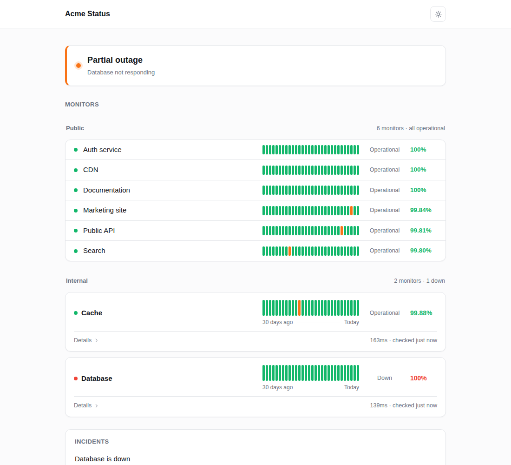
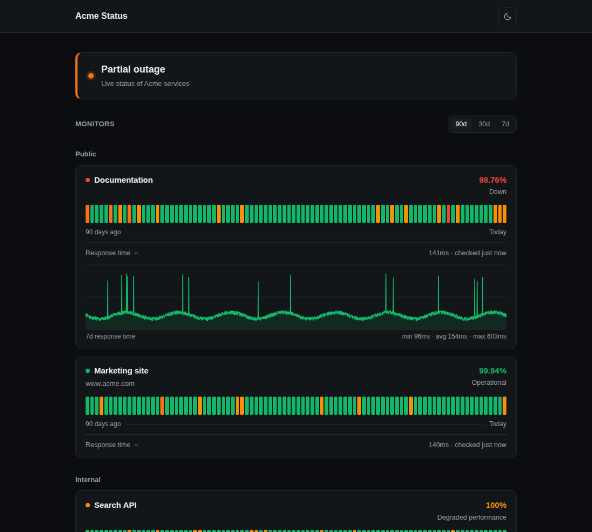
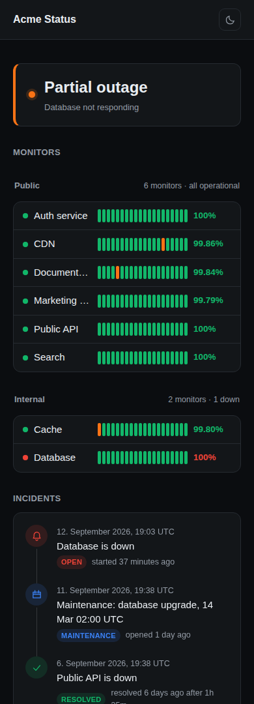

# status-page

Uptime monitoring that runs entirely on GitHub: checks run as a scheduled
Action, history is committed to this repository, outages open and close GitHub
issues, and the status page is published with GitHub Pages.


| Light | Response time | Mobile |
| --- | --- | --- |
| [](.screenshots/light.png) | [](.screenshots/response-time.png) | [](.screenshots/mobile.png) |

## Setup

1. Fork or copy this repository.
2. **Settings → Pages → Source**: select *GitHub Actions*.
3. **Settings → Actions → General → Workflow permissions**: select *Read and
   write permissions*.
4. Add one repository variable per monitor under **Settings → Secrets and
   variables → Actions → Variables** (see below), or a secret in the same place
   for a monitor whose URL should stay private.
5. Run the **Uptime** workflow once from the Actions tab.

## Custom domain

Point DNS at GitHub, then set the domain under **Settings → Pages → Custom
domain** and enable *Enforce HTTPS* once the certificate is issued.

```
# subdomain
status  CNAME  <user>.github.io.

# apex domain
@  A     185.199.108.153, 185.199.109.153, 185.199.110.153, 185.199.111.153
@  AAAA  2606:50c0:8000::153, 2606:50c0:8001::153, 2606:50c0:8002::153, 2606:50c0:8003::153
```

Because Pages is published from a workflow rather than a branch, no `CNAME`
file is needed: the domain is stored in the repository's Pages configuration,
and an existing `CNAME` file is ignored. Deployments cannot drop it.

Verify the domain under account or organization **Settings → Pages** to keep
someone else from claiming it if this repository is renamed or deleted. If DNS
is proxied through Cloudflare, keep the record DNS-only until GitHub has issued
the certificate.

## Monitors

Every monitor is a repository variable named `MONITOR_<NAME>`. The name after
the prefix becomes the slug and the default display name. The value is either a
plain URL or a JSON object.

```
MONITOR_WEBSITE   https://example.com
MONITOR_API       {"name":"Public API","url":"https://api.example.com/health","keyword":"ok","group":"Core"}
MONITOR_SMTP      {"name":"Mail","url":"tcp://mail.example.com:25","keyword":"220"}
```

An `http` or `https` URL is requested over HTTP. A `tcp://host:port` URL is
checked by opening a connection: the monitor is up when the handshake
completes, and the measured time is the handshake itself. With `keyword` set,
the check also waits for the first chunk the server sends and matches it
against that string, which covers banner protocols such as SMTP, SSH or IMAP.
`method`, `headers`, `body`, `expectedStatus` and `followRedirects` do not
apply to a TCP monitor, and its address is not used as the card link — set
`link` if the card should point somewhere.

| Key | Default | Description |
| --- | --- | --- |
| `url` | required | `https://…` to request, or `tcp://host:port` to connect to |
| `name` | derived from the variable name | Display name |
| `method` | `GET` | HTTP method |
| `headers` | `{}` | Request headers |
| `body` | none | Request body |
| `expectedStatus` | `2xx` | Status code, `2xx` style pattern, `200-299` range, or an array of those |
| `keyword` | none | Response body, or the first chunk of a TCP banner, must contain this string |
| `timeout` | `10000` | Milliseconds before the request is aborted |
| `retries` | `1` | Extra attempts before a check counts as failed |
| `degradedMs` | `0` | Responses slower than this are reported as degraded (`0` disables) |
| `followRedirects` | `true` | Follow 3xx responses |
| `group` | none | Groups monitors under a heading |
| `description` | none | Subtitle on the card |
| `link` | `url` | Link target of the monitor name |
| `private` | `false`, `true` for secrets | Keeps the URL out of the published site and out of incident issues |
| `order` | `100` | Sort order within a group |
| `slug` | derived from the variable name | Overrides the slug used for history files |

### Private monitors

A monitor can be defined as a repository **secret** instead of a variable, with
the same name and the same value format. Secrets are masked in workflow logs,
and a monitor defined that way is private: its URL is left out of
`api/summary.json`, left out of the incident issue, and stripped from error
messages such as `getaddrinfo ENOTFOUND …`.

What is still published for a private monitor: the slug derived from the secret
name, the display name, the group and description, and the status, uptime and
response times. Set `link` if the card should point somewhere anyway. Adding
`"private": true` to a monitor defined as a variable has the same effect.

## Site variables

| Variable | Default | Description |
| --- | --- | --- |
| `SITE_TITLE` | `Status` | Page and browser title |
| `SITE_DESCRIPTION` | none | Line under the status banner |
| `SITE_LINK` | none | Link in the footer |
| `SITE_LOGO` | none | Logo URL shown next to the title |
| `SITE_THEME` | `auto` | `auto`, `light` or `dark` |
| `INCIDENT_THRESHOLD` | `2` | Consecutive failed checks before an issue is opened |
| `INCIDENT_LABELS` | `status,incident` | Labels applied to incident issues |

## How it works

`.github/workflows/uptime.yml` runs every five minutes:

1. `scripts/check.mjs` requests every monitor and appends the result to
   `history/`.
2. `scripts/incidents.mjs` opens an issue when a monitor has failed
   `INCIDENT_THRESHOLD` times in a row, comments the downtime and closes the
   issue on recovery, and writes a snapshot of recent incidents.
3. The history is committed back to the branch.
4. If any monitor changed state, the Pages workflow deploys immediately;
   otherwise the site rebuilds on its own 30 minute schedule.

`.github/workflows/pages.yml` runs `scripts/build.mjs`, which turns the history
into `_site/api/*.json` next to the static page in `site/`.

History is stored per monitor as CSV:

```
history/raw/<slug>.csv     every check of the last 7 days (response time chart)
history/daily/<slug>.csv   one aggregated row per day, kept indefinitely
history/state.json         current status and open issue per monitor
history/incidents.json     snapshot of recent incident issues
```

Issues labelled with the incident label show up on the page, so you can also
open one by hand for planned work; add a `maintenance` label to mark it as such.

## Local preview

```bash
export CONFIG_VARS='{"SITE_TITLE":"Status","MONITOR_WEBSITE":"https://example.com"}'
node scripts/check.mjs
node scripts/build.mjs
npx serve _site
```

`CONFIG_VARS` and the optional `CONFIG_SECRETS` are the JSON objects that the
workflows pass in from the Actions `vars` and `secrets` contexts.
`scripts/incidents.mjs` additionally needs `GITHUB_TOKEN` and
`GITHUB_REPOSITORY`.

## Notes

- Scheduled workflows are queued, not guaranteed: runs drift by several minutes
  under load, and GitHub disables schedules in repositories with no activity for
  60 days.
- Actions minutes are free on public repositories. On a private repository
  every job is rounded up to a whole minute, so the cost follows the number of
  runs, not their duration: the default schedule is roughly 336 job-minutes a
  day. Lengthen the two cron expressions to cut that, or keep the repository
  public and define sensitive monitors as secrets.
- The workflows use the Node.js that ships with the runner image, currently
  22.x, so there is no toolchain setup step.
- Uptime percentages count degraded checks as up; the day tooltip shows the
  share of successful checks.
- Checks run from GitHub's runners, so they only see outages that are visible
  from the public internet.

## License

MIT — see [LICENSE](LICENSE).
